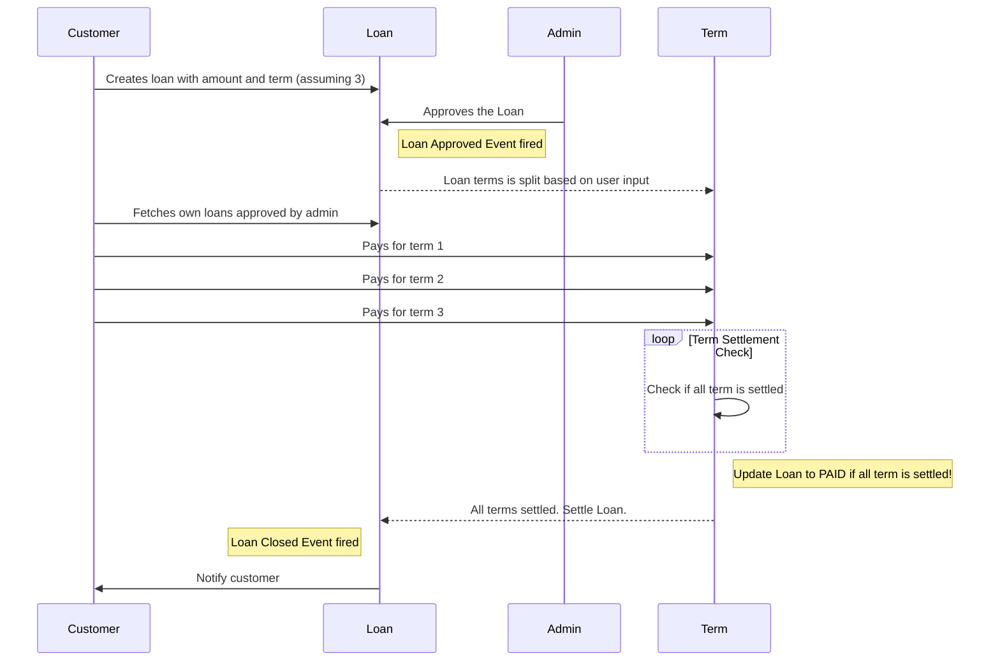

# Aspire (Lite Version)

Basically aspire lite version consists of following modules

- Customer
- Admin
- Loan
- Term

# Installation

Begin by pulling in the github repo

`git clone https://github.com/Sarav-S/aspire-code-challenge.git`

Next, install the composer packages

`composer install`

Apart from above, no more additional configuration is required. Simply copy the contents of `.env.example`  to `.env` and modify the database connection string. Run the migration and seeders then you're good to go.

`php artisan migrate && php artisan db:seed`

and finally,

`php artisan serve`

to start the application

# Basic Flow

Logical conditions

- All loan and term actions can be performed only by authenticated customer
- Customer can pay term amounts only for admin approved loans.

## Postman Collection

You can find the postman collection here : https://www.getpostman.com/collections/c2213e05c392cf7167ef

## Model Events

I've used Model events for handling terms creation and loan settlements. 

- When customer creates a loan, it'll be submitted for admin approval. Once admin approves the loan, terms for the loan will be created using the `update` model event and is processed by `LoanObserver`
- Each time customer makes term payment, term `update` event is fired and captured by `TermObserver` validating whether all terms have been settled. If settled, then respective loan's status will be changed to `PAID` 

## Jobs

I've created 3 jobs, 

- `LoanApproved` - Triggered when admin approves the loan. Can fire either SMS or Email.
- `LoanRejected` - Triggered when admin rejects the loan. Can fire either SMS or Email.
- `LoanClosed` - Triggered when customer pays all the term dues.

## Code Coverage

I've ensured all of my code is properly tested with testcases. You can find the code coverage of my application under the `html` folder

## Unhandled Cases

I've not handled the following scenarios for this lite version

- Recalculating the remaining term amount when customer pays extra amount on a particular term
- Ability to pay all the loan amount in a single term 
- Date validation for the terms ie, as of now customer can pay all the terms on a single day
- Customers can pay terms on any order ie, pay 3rd term and then 2nd and 1st.
